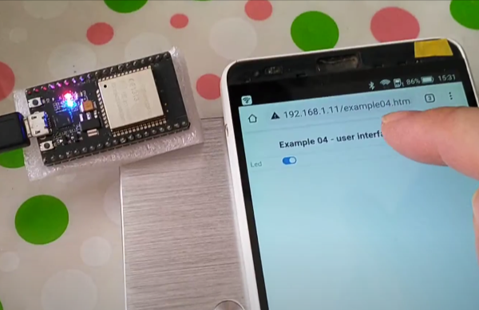
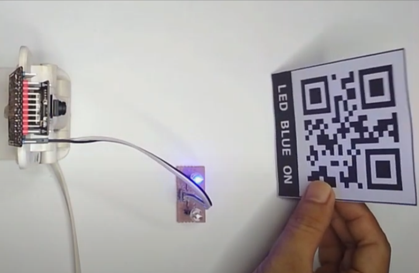
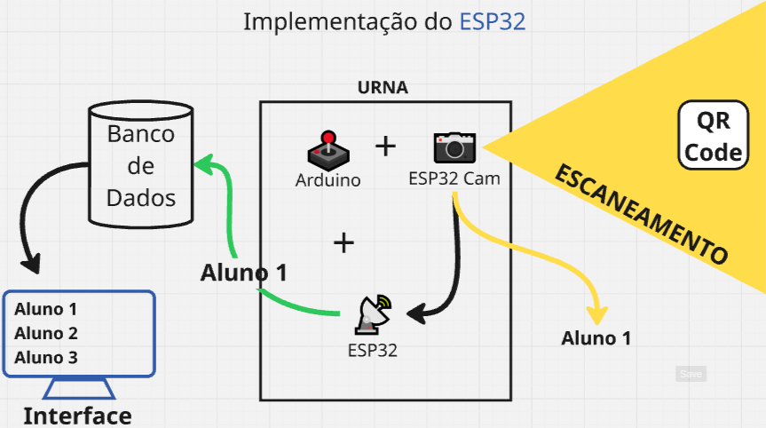

<h1 align=center>🚀 Eu nunca vi um cientista 🚀<h1>

## Projeto QR Code para Controle de Presença

Criação de um sistema para Controle de presença, visando a segurança de alunos e funcionários da escola

<br>

**licença e tecnologias utilizadas**:  
 <a href="https://docs.python.org/3/"></a>

<br>

<details open="open">
<summary>Tabela de Conteúdos</summary>
  
- [💡 Ideia Inicial](#ideia)
  - [Utilização do `ESP32` para **IOT**](#esp32)
  - [Implementação do `ESP32`](#implementacao)
  - [Implementação de Banco de Dados (futuro)](#implementacao-db)
- [🛠 Recursos Gerais](#recursos)
- [⚙ Geração de QR code](#qrcode)
- [📄 Referências](#ref)
  
</details>

<br>

<a name="ideia"></a>

## 💡 Ideia Inicial
<a name="esp32"></a>
### Utilização do `ESP32` para **IOT** (rede de dispositivos físicos que são conectados à internet e podem coletar e compartilhar dados)



### Utilização do `ESP32` para escaneamento de QR Code



O microcontrolador `ESP32` é amplamente utilizado para a criação de Web Servers embarcados (servidor web que está integrado em um dispositivo, como um microcontrolador, permitindo que ele ofereça serviços web, como páginas HTML, sem a necessidade de um servidor web separado), graças ao seu poder de processamento, conectividade Wi-Fi e suporte a protocolos modernos. Abaixo estão as principais características, benefícios e funcionamento nesse contexto:

- Baixo Custo e Alto Desempenho  
Comparado a soluções como Raspberry Pi, o ESP32 é mais barato e consome menos energia, sendo ideal para **IoT** (rede de dispositivos físicos que são conectados à internet e podem coletar e compartilhar dados).

- Suporte a Protocolos Web Modernos  
HTTP/HTTPS, WebSocket, MQTT (para comunicação em tempo real).

- Multitarefa  
Pode rodar um servidor web enquanto executa outras tarefas em paralelo (Leitura a partir de sensores, por exemplo).

- Fácil Integração com Sensores e Atuadores  
Pode ler sensores (DHT11, LM35, etc.) e controlar dispositivos (relés, LEDs, motores) via interface web.

<a name="implementacao"></a>
### Implementação do `ESP32`

Utilização em modo `Station` (STA)

1. O `ESP32` conecta-se a um roteador Wi-Fi existente.
2. O servidor web fica acessível via IP local (ex: 192.168.1.100).

Exemplo de Funcionamento (Fluxo Básico)

1. Inicialização do Wi-Fi  
O ESP32 conecta-se a uma rede

2. Configuração do Servidor Web  
Usando bibliotecas como ESPAsyncWebServer ou WebServer, define-se rotas (ex.: /, /data).

3. Tratamento de Requisições  
`GET:` Envia JSON (ex: leitura de sensores).  
`POST:` Recebe dados de formulários (ex: acionar um relé).

4. Interface do Usuário  
Página HTML simples e intuitiva, Planilha Excel (Visualização dos dados)

#### Exemplo com imagem



<a name="implementacao-db"></a>
### Implementação de Banco de Dados (futuro)

- [ ] Escolha do Banco de dados para armazenar registros
- [ ] Implementação e Conexão com `ESP32`

<br>

<a name="recursos"></a>
### 🛠 Recursos Gerais

- ESP32 Cam
- ESP32 Module
- Arduino UNO
- **opcional:** ESP32-CAM-MB
- **opcional:** ESP8266 (ESP01)
- Jumpers Elétricos
- LEDs
- Resistores

<br>

<a name="qrcode"></a>
### ⚙ Geração de QR code

⚫[QR Code Monkey](https://www.qrcode-monkey.com/) → Gera um por um, mas é fácil de usar.  
⚫[QR code API](https://goqr.me/api/) → API gratuita para gerar em massa.  
🟢 Usando `Python` → para gerar em massa (com logo).

#### Gerando com Python

> [!TIP]
> Documentação da biblioteca `qrcode` → [Clique aqui](https://pypi.org/project/qrcode/)

1. Instalação das bibliotecas qrcode e Pillow:
```bash
pip install qrcode[pil]
```

2. Código
```py
import os
import qrcode
from PIL import Image

def generateQRCodeWithLogo(data, outputFolder, filename, logoPath):
    # Cria a pasta de saída se não existir
    os.makedirs(outputFolder, exist_ok=True)
    
    # Configura o QR code
    qr = qrcode.QRCode(
        version=1,
        error_correction=qrcode.constants.ERROR_CORRECT_H,
        box_size=10,
        border=4,
    )
    qr.add_data(data)
    qr.make(fit=True)
    
    # Cria imagem do QR code
    img = qr.make_image(fill_color="black", back_color="white").convert('RGB')
    
    logo = Image.open(logoPath)
    
    # Calcula tamanho máximo da logo (20% do QR code)
    max_logo_size = min(img.size) // 5
    logo.thumbnail((max_logo_size, max_logo_size), Image.LANCZOS)
    
    # Calcula posição para centralizar a logo
    pos = ((img.size[0] - logo.size[0]) // 2, (img.size[1] - logo.size[1]) // 2)
    
    # Cola a logo no QR code
    img.paste(logo, pos)
    
    # Salva imagem
    img.save(os.path.join(outputFolder, f"{filename}.png"))

def batchGenerateQRCodeWithLogo(outputFolder, logoPath):
    dataList = []

    for i in range(1, 11): # Gera 10 IDs
        dataList.append({
            "data": f"ID{i}",
            "filename": f"QRcode-{i}"
        })

    for item in dataList:
        print(f"Arquivo: {item['filename']}")
        print(f"Dado: {item['data']}")

        generateQRCodeWithLogo(
            data=item['data'],
            outputFolder=outputFolder,
            filename=item['filename'],
            logoPath=logoPath
        )


outputFolder = "qrcodes"

logoPath = "logoPath"

batchGenerateQRCodeWithLogo(outputFolder, logoPath)

print(f"QR codes gerados na pasta '{outputFolder}'")
```

3. Exemplo de resultado


<br>

<a name="ref"></a>
### 📄 Referências
- &nbsp; [WebServer: Arduino UNO com WiFi ESP01](https://youtu.be/_WPXhNV07Q8?si=PmHWCHl0Lrf5LABd) → configuração e explicação arduino + ESP8266 (ESP01)
- &nbsp; [Arduino Retornando Dados no Formato JSON no Web Server](https://youtu.be/eSMZxWEYgZs?si=KtAnpWq5ySvwE1lo) → configuração do arduino + Ethernet Shield para retorno de JSON no web server
- &nbsp; [Program ESP32-CAM using Arduino UNO](https://easyelectronicsproject.com/esp32-projects/program-esp32cam-arduino/) → configuração da ESP32 cam + arduino
- &nbsp; [Arduino IDE + ESP32 CAM | ESP32-CAM QR Code Scanner](https://www.youtube.com/watch?v=tZV7b8dGgw4) → ESP32 CAM + ESP32-CAM-MB
- &nbsp; [Criando um Web Server com ESP32](https://www.youtube.com/watch?v=ZSyqNFGAF8o) → exemplo da biblioteca `WiFi` do ESP32
- &nbsp; [ESP32 Documentation](https://docs.espressif.com/projects/arduino-esp32/en/latest/index.html) → WiFi API, Wi-Fi STA Example
